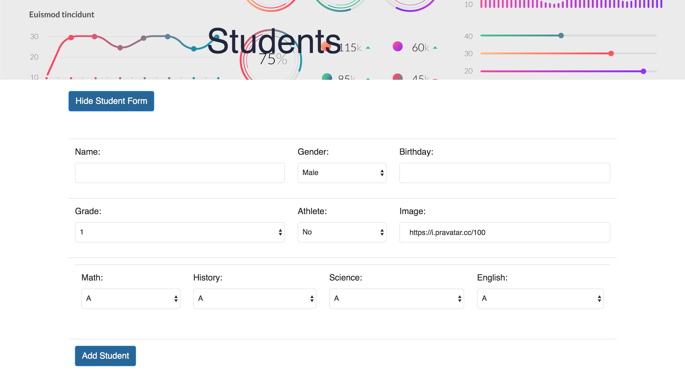

# calculateGPA
RipeMetrics coding challenge using React.js to calculate students GPA

User can add, delete and view students list with calculated GPA. This application uses Javascipt, with Node.js and React, HTML, and CSS.

- - -

For questions or concerns, please go to my website at caracrotty.herokuapp.com or send an email at admin@caracrotty.com.